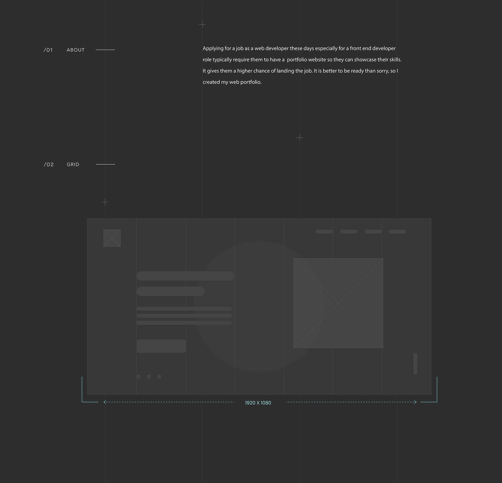
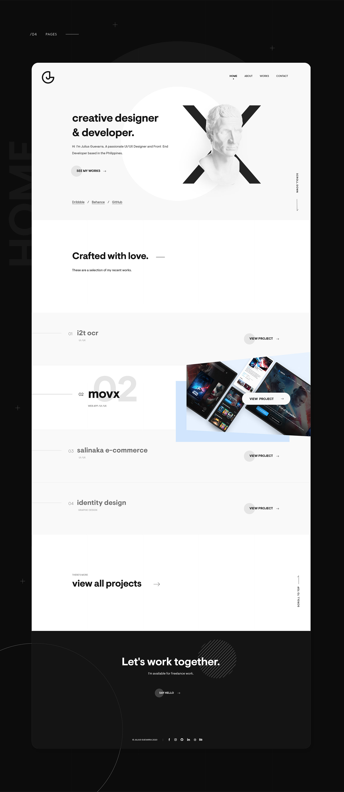
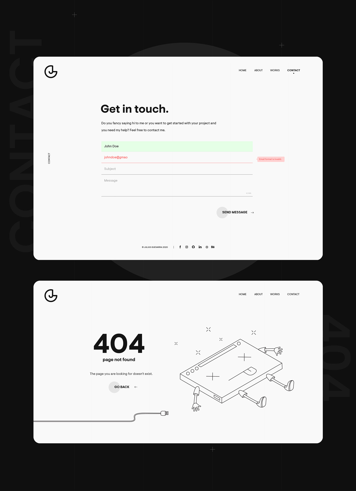
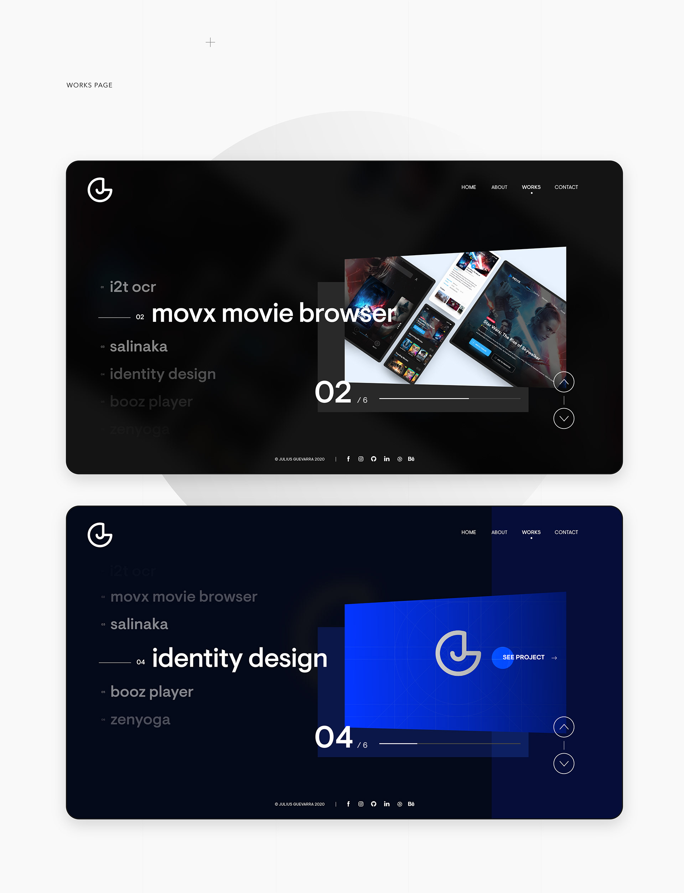
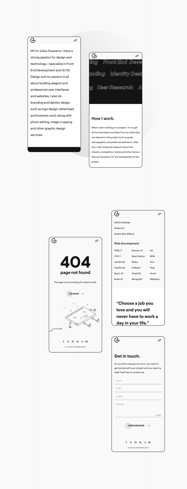

<h1 align="center">
  <a href="https://davidcobbina.com" target="_blank">davidcobbina.com</a>
</h1>

    This is the second Iteration of my portfolio website (https://github.com/david-legend/aerium).

    It is inspired by <a href="https://www.behance.net/gallery/63574251/Personal-Portfolio-Website-Design" target="_blank">Julius Guevarra's Designs on Behance</a>

## 🚨 Forking this repo (please read!)

I value keeping my site open source, but as you all know, _**plagiarism is bad**_. It's always disheartening whenever I find that someone has copied my site without giving me credit. I spent a non-trivial amount of effort building and designing this website, and I am proud of it! All I ask of you all is to not claim this effort as your own.

### TL;DR

Yes, you can fork this repo. Please give me proper credit by linking back to [davidcobbina.com](http://davidcobbina.com). Thanks!

## Enjoy

